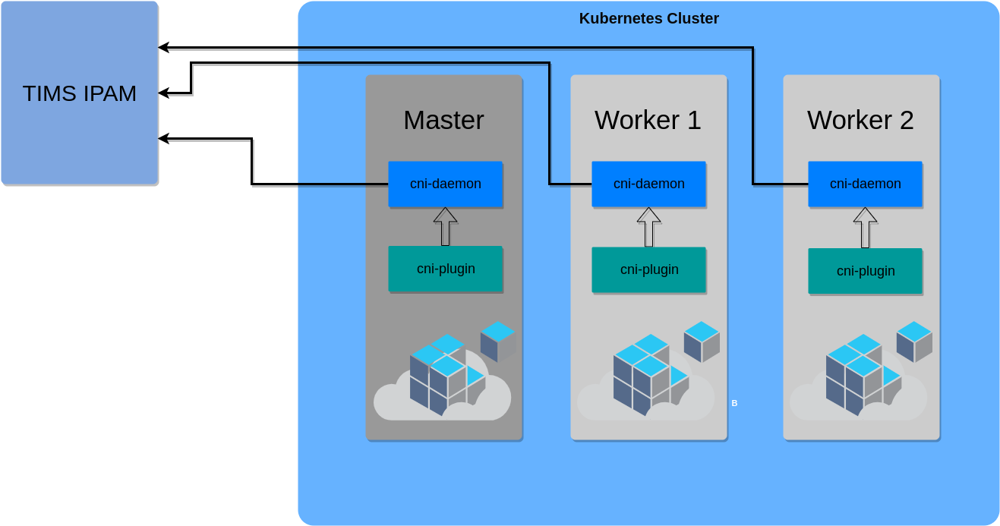

# Tcpwave CNI Driver
CNI Plugin for TIMS IPAM and Kubernetes Integration

## Architecture
The CNI plugin consists of two components.
  1. CNI Daemon
  2. CNI Plugin
**CNI Daemon** must run on all the nodes provisioned for kubernetes cluster
as this component is responsible to make interactions with TIMS IPAM. It acts as
a helper to cni plugin.

**CNI Plugin** is the actual plugin and gets invoked on very container
add/delete events.

Here is a diagram depicting the interaction of IPAM, CNI-Plugin, CNI-Daemon and
Containers. For the sake of simplicity a kubernetes setup of 3 nodes with 1 master
and 2 worker is shown.
The plugin and daemon must be configured with proper client certificates on all
nodes before provisioning any containers in the cluster.

## Building Project
If the project is being build for the first time then run **dep init** first,
then the below commands to generate the binaries.
**make build**
This will generate two file **bin/tcpwave-cni** and **bin/tcpwave-cni-daemon**

## Configuration
**tcpwave-cni-daemon** binary must run on all the nodes provisioned for kubernetes
cluster as this component is responsible to make interactions with TIMS IPAM.
There is service file **scripts/cni-daemon.service**, this should be configured
properly for daemon binary and certificates paths and should be registered to
start at system boot.

**tcpwave-cni** binary should be placed at path **/opt/cni/bin/** and corresponding
configuration file should be places at path **/etc/cni/etc.d/**.
Sample file at **examples/bridge/tcpwave-cni.conf** should be configured properly.
